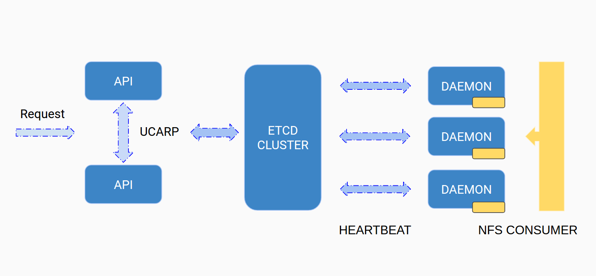

# Architecture

## Cobalt
The Cobalt cluster is comprised of one or more API nodes (no matter the no. there will always be a single master) that will
process client commands and designate resource nodes on which the actions will take place.
Each resource node will provide inside the ETCD cluster its current capacity and status in order for the API to decide where
volume actions should be assigned.
Resource nodes will periodically check to see if it has actions to be done or will get notified by the ETCD cluster of
changes that need to be applied.

##### Purpose

- [BTRFS](https://en.wikipedia.org/wiki/Btrfs) volume management.

### Overview

### API
The brain of the entire system will decide when to transition volume states from one state to another, will launch volume
tasks.

##### Purpose

- Volume Scheduling / Orchestration

##### TODO: Decide on packing algorithm for efficient resource allocation
    - binpack
    - First Fit Decreasing Binpack
    - Harmonic algorithm
    - http://stackoverflow.com/a/28874577
    - other

### Agent
Each resource node will have an agent running that will reconcile with the ETCD cluster and its local state making sure that
they will eventually be one and the same.
It is responsible for providing its state in the ETCD cluster so that the API can pick a suitable candidate for its next operation

##### Purpose

- Volume management

[Daemon](https://pypi.python.org/pypi/python-daemon/) is used as task may be created at irregular intervals and need to
be processed as soon as possible. Careful care needs to be taken so the daemon restarts on possible failures.

ETCD communication will be implemented using [python-etcd](https://github.com/jplana/python-etcd)

## User-facing Objects

### Volume

Each volume object will have details of the permissions granted on the btrfs filesystem, its size, dilation percentage
and resource filters.
After a volume has been added to a machine only its state can be changed. If the dilation space allotted by the client
was not enough a clone / move operation will be the only way to change such properties.

### Machine

Each machine will provide its current operating state (disk available / usages / metadata) along with the current state
of the volumes under its control.

### State

Both volumes and machines have a state used to determine what actions need to take place. Details [here](STATES.md)

## Security

ETCD cluster should be configured using TLS.

##### TODO
