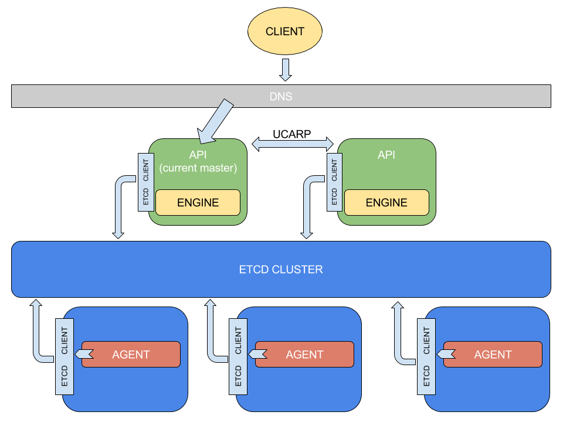
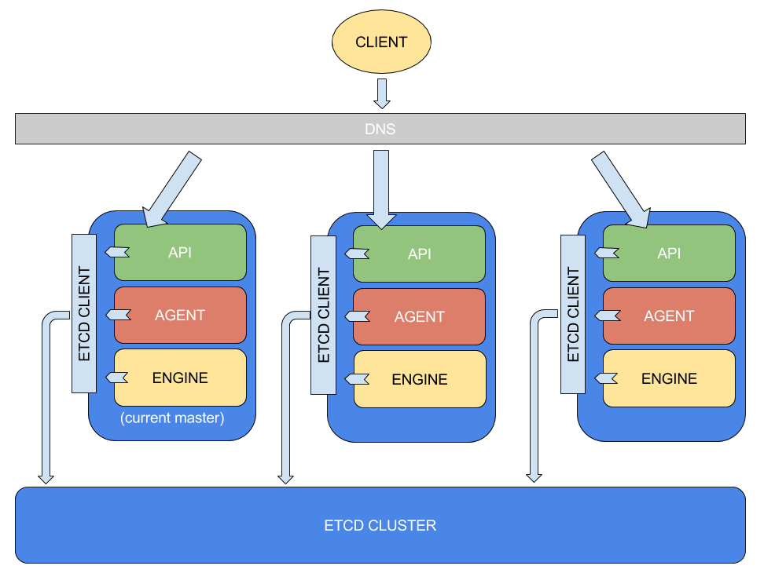

# Architecture

## Possibilities

- API-engine & agent architecture
- API, engine & agent architecture

## Objective

Both architecture ideas will be presented with respect to separation of
concerns, decoupling along with the pros and cons in order to conclude to the
choice we have made here.

---

## API-engine & agent architecture

This architecture assigns the API-engine nodes two main roles:

- Processing client requests (API)
- Making decisions regarding who should do the requested jobs (Engine)

### Processing client requests

The client (be it a web application, or a cli) will send BTRFS volume requests
towards the API-engine nodes. Each of them will compete for acquiring the lease
for being master. The master node at that given moment will process the request
and prepare it for getting assigned to a storage box. This way we can avoid
multiple nodes processing the same request.

### Decision making

After the request has been processed, the engine will check which storage box
would be ideal for doing the work. Criteria for making this decision could be
optimal criteria (free space available, task queue size) and required criteria
(node availability). This information will all be available for both API-engine
nodes and storage box nodes in the etcd cluster. The engine will then delegate
the job to a storage box by writing it inside the etcd cluster.

---

The storage boxes will share their state with the etcd cluster through
heartbeats performed by the agent. When the agent sees that its current state
is different from the state found in etcd, it will check for the difference
(which will consist of the new volume request) and place the new job as a task
in its queue.

#### Pros

- The only role of the API is to process requests. It has no need to
communicate with an external service (etcd)
- Decision making relies exclusively on the engine, which conceptually is
correct
- The storage boxes have only one responsibility beside data storage,
that being volume management itself, which is the main purpose of Cobalt
- Storage node downtime does not imply inaccessibility to the API. Requests
can still be made and will be resolved later

#### Cons

- Increased number of nodes
- If none of the storage box agents can schedule new pending requests, the risk
of an infinite loop occurs and none of the API-engine nodes can return an error
response to the client

---

## API, engine & agent architecture

This architecture has all three components residing on each storage box.
All three need to communicate with the etcd cluster in order to fulfill their
job.

### API

The API component is once again responsible for receiving client requests and
placing them in the etcd cluster.

### Engine

The engine component will compete for acquiring the master lease and will
delegate jobs for itself and for the other nodes as well by comparing their
current states with the desired states on the etcd cluster. Like in the previous
 architecture schema, only one engine can be master at any point in time and
 only that node will make decisions for the whole cluster.

### Agent

The agent will share its node's state to etcd and notice differences when new
jobs are placed there. It will then try to bring the node from its current state
 (e.g. `n` created volumes) to the desired state (e.g. `n+1` created volumes)
 by accomplishing the jobs assigned to it.

#### Pros

- The etcd cluster is internal to the storage box cluster. There is no need for
any other node types to communicate with it
- One less layer of complexity: if a problem occurs, the entire logic resides
in one place. Network connectivity issues are less likely to be the problem.

#### Cons

- Full failure: if the node is down for some reason, none of its components will
 do their job. Unlike in the first architecture implementation, this one does
 not permit sending requests to be processed by the API and scheduled later,
 when the storage node is restored to a functional state

---

## Conclusions

While the first proposed architecture puts less work on the storage nodes,
the second one promotes simplicity by getting rid of extra layers of
communication while keeping the components decoupled and their roles consistent.
Our choice was to go with the API, engine & agent architecture.
